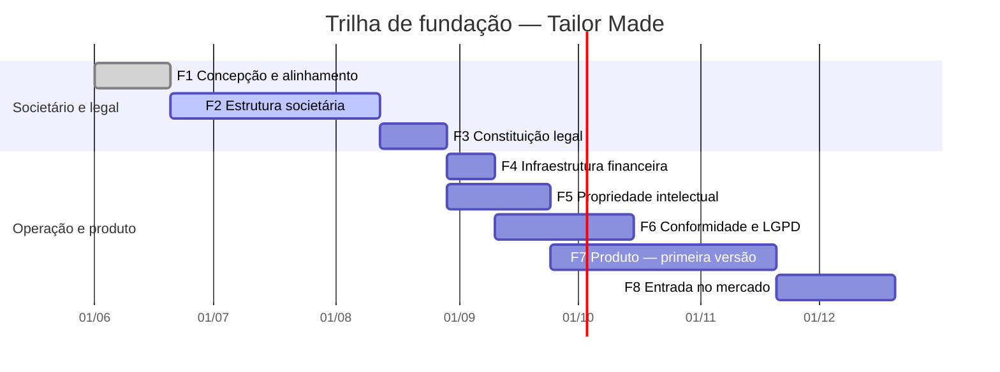

# TAILOR MADE — Painel de Fundação
## Documento mestre de construção

Versão 1.0 · handoff para Claude Code
Referência visual: `tailor-made-painel.jsx` (mockup, **não** é código de produção)

---

## 0. Premissa arquitetural

A Tailor Made **funda startups**. Este painel não é o sistema interno de uma empresa: é o
sistema que acompanha a fundação de *cada* empresa criada por ela.

Consequência: `org_id` em toda tabela desde a primeira migration. Retrofit de
multi-tenancy depois de 20 tabelas custa mais que fazer certo agora.

**Princípio central (herdado do padrão SomaVerso):** o veredito é determinístico, o LLM
apenas narra. Nenhum alerta, status de fase, resultado de deliberação ou risco é gerado
por modelo. Tudo sai de regra em TypeScript sobre registro em banco, e todo alerta
carrega `origem: { tabela, id }`. Se não há registro, não há afirmação.

---

## 1. Stack

| Camada | Escolha | Por quê |
|---|---|---|
| App | Next.js 16 (App Router) + TypeScript strict | RSC reduz o estado de cliente que o mockup usa. Versão estável padrão no momento da construção (jul/2026) |
| Banco / Auth / Storage / Realtime | Supabase | RLS resolve o controle de acesso no banco, não na aplicação |
| Mutações | `next-safe-action` + Zod | Contrato tipado por ação, validação e auditoria automáticas |
| Tempo real | Supabase Realtime | Mensagens, votos e movimentos |
| Assinatura | Autentique (webhook) | Já em uso no seu stack |
| Jobs | Supabase `pg_cron` | Encerrar deliberações no prazo, recalcular fôlego de caixa |
| Narração | Claude Haiku 4.5 | Recebe fatos prontos, devolve prosa. Sem acesso a banco, sem tool calling |

Sem ORM. SQL e tipos gerados por `supabase gen types typescript`.

---

## 2. Modelo de dados

### 2.1 Núcleo

```sql
orgs                 id, nome, cnpj (null até constituição), estagio, criada_em
membros              id, org_id, user_id→auth.users, nome, email,
                     papel ('admin'|'socio'|'tecnico'|'convidado'),
                     participacao_pct numeric(5,2), ativo, entrou_em
```

`participacao_pct` **não é editável por formulário**. Só muda como efeito de uma
deliberação aprovada (ver SA-25). Essa é a trava mais importante do sistema.

### 2.2 Trilha

```sql
fases                id, org_id, ordem, nome, trilho ('legal'|'op'),
                     responsavel_id→membros, inicio_previsto date, prazo date
fase_itens           id, fase_id, ordem, titulo, concluido bool,
                     concluido_por, concluido_em,
                     depende_documento_id→documentos (nullable)
```

`depende_documento_id` é o que permite a regra R02: uma fase fica bloqueada quando um
item depende de documento que não existe. É o vínculo que o mockup insinua e o banco
precisa tornar explícito.

`inicio_previsto` não existe no mockup — lá só há `prazo`. Ele entra aqui porque o Gantt
(abaixo) precisa de dois pontos por fase, não um. Sem `inicio_previsto` explícito, a
única opção é inferir o início pelo fim da fase anterior, e aí o gráfico passa a
"adivinhar" — o que contraria o princípio central do documento. O campo é preenchido na
criação da fase (`SA-07` ou uma nova `fase.criar`), nunca calculado no cliente.

**Vista Gantt da trilha.** Mesma fonte de dados da Trilha (`fases` + `fase_itens`),
apresentada como linha do tempo em vez de lista vertical. Cada barra vai de
`inicio_previsto` a `prazo`; a cor da barra reaproveita a paleta dos anéis do cockpit
(vermelho para `legal`, azul para `op`); o preenchimento da barra é a fração de
`fase_itens` concluídos, igual à barra de progresso que já existe em cada card de fase na
Trilha. Fase sem `inicio_previsto` não aparece no Gantt e gera um aviso — o gráfico não
estima, só desenha o que foi registrado. Ilustração com os dados da fixture do mockup:



`done`/`active` vêm do mesmo cálculo que já existe para o card de fase (`feitos ===
itens.length` e "fase atual"), não de um status paralelo — um único lugar decide se uma
fase está concluída.

### 2.3 Debates

```sql
canais               id, org_id, slug, nome, descricao, arquivado
canal_membros        id, canal_id, membro_id, adicionado_em
mensagens            id, canal_id, autor_id, corpo, respondendo_a,
                     criado_em, editado_em
mensagem_versoes     id, mensagem_id, corpo_anterior, editado_em
registros            id, org_id, codigo, mensagem_id,
                     texto_snapshot, guardado_por, guardado_em
```

`registros.texto_snapshot` guarda o texto no momento em que foi fixado. Se a mensagem
original for editada, o registro não muda. Livro de registro que reescreve o passado não
serve de memória.

`canal_membros` não estava no desenho original — apareceu ao implementar a RLS da seção 3
("convidado: whitelist explícita... o canal onde foi incluído"). Sem uma tabela de
associação, essa frase não tem como virar policy. `admin`/`socio`/`tecnico` continuam
vendo todos os canais da org independente desta tabela; ela só é consultada para o papel
`convidado`.

### 2.4 Documentos

```sql
documentos           id, org_id, codigo, nome, grupo, responsavel_id,
                     status ('ausente'|'rascunho'|'revisao'|
                             'aguarda_assinatura'|'assinado'|'vencido'),
                     critico bool, vence_em date
documento_versoes    id, documento_id, versao int, storage_path,
                     hash_sha256, enviado_por, enviado_em
assinaturas          id, documento_versao_id, membro_id,
                     status ('pendente'|'assinada'|'recusada'),
                     provider, provider_ref, assinado_em
documento_grupo_acessos  id, membro_id, grupo
```

Documento com `status='ausente'` é criado **antes** de existir arquivo. É assim que o
DOC-06 aparece em vermelho no painel em vez de simplesmente não existir. A ausência é um
registro, não um vazio.

`documento_grupo_acessos` é a contraparte de `canal_membros` para o cofre: o mesmo
"whitelist explícita" da seção 3, aplicado a `grupo` em vez de canal. Só o papel
`convidado` é filtrado por ela.

### 2.5 Governança

```sql
deliberacoes         id, org_id, codigo, titulo, corpo, quorum_pct,
                     status ('rascunho'|'aberta'|'aprovada'|'rejeitada'|'expirada'),
                     abre_em, encerra_em, origem_mensagem_id, ata_id
votos                id, deliberacao_id, membro_id,
                     voto ('sim'|'nao'|'abstencao'),
                     peso_pct numeric(5,2),   -- SNAPSHOT no momento do voto
                     justificativa, criado_em,
                     hash_anterior text, hash text
                     UNIQUE (deliberacao_id, membro_id)

reunioes             id, org_id, codigo, titulo, tipo, inicio, fim, link
reuniao_pauta        id, reuniao_id, ordem, item, proposto_por
atas                 id, reuniao_id, corpo, publicada_em, publicada_por, hash
encaminhamentos      id, org_id, titulo, responsavel_id, prazo,
                     status ('aberto'|'concluido'|'cancelado'),
                     origem_tipo, origem_id
```

Dois pontos que só aparecem quando o mockup vira produção:

**`votos.peso_pct` é snapshot.** Se a participação societária mudar em 2027, a D-004 de
2026 continua com o resultado que teve. Sem isso, deliberação passada muda de veredito
sozinha.

**Cadeia de hash em `votos` e `atas`.** `hash = sha256(hash_anterior || payload)`. Sem
`UPDATE` nem `DELETE` — revogados por policy. Ata e voto são append-only ou não valem nada.

### 2.6 Financeiro

```sql
aportes              id, org_id, membro_id, comprometido_cents bigint, prazo
aporte_eventos       id, aporte_id, valor_cents, data, comprovante_documento_id
movimentos           id, org_id, codigo, descricao, valor_cents,
                     categoria, direcao ('entrada'|'saida'),
                     status ('previsto'|'aguarda_aprovacao'|'aprovado'|'pago'|'rejeitado'),
                     solicitante_id, aprovador_id,
                     comprovante_documento_id, competencia date
```

Dinheiro em `bigint` de centavos. `numeric` também serve; `float` não.

### 2.7 Auditoria

```sql
auditoria            id, org_id, ator_id, acao, entidade, entidade_id,
                     antes jsonb, depois jsonb, ip, criado_em
```

Escrita pelo runtime de Safe Actions, nunca manualmente. Append-only.

### 2.8 Sugestões (mensagem → registro)

Chat é testemunho, KPI precisa de registro. A conversa nunca escreve direto num dado que
o painel confia — ela só pode gerar uma sugestão, que um humano confirma ou descarta.

```sql
sugestoes            id, org_id, mensagem_id, tipo ('movimento'|'aporte'|
                     'encaminhamento'|'documento'|'deliberacao'),
                     payload jsonb,        -- campos extraídos, pré-preenchidos
                     confianca numeric,
                     status ('pendente'|'promovida'|'descartada'),
                     promovida_em, promovida_por, registro_id
```

`payload` é o palpite da IA a partir da mensagem (ex.: "R$ 62.400, competência julho").
`registro_id` só é preenchido na promoção, e aponta para a linha real criada em
`movimentos`, `aportes`, `encaminhamentos` etc. — o payload confirmado pelo humano vence o
sugerido, sempre; se o humano editar o valor antes de promover, é o valor editado que vira
registro, não o extraído.

O caminho inverso — do registro para a conversa — é seguro e vale a pena: quando uma
deliberação fecha ou um documento é assinado, o painel posta sozinho no canal
correspondente ("D-004 aprovada, 80% a favor" em `#juridico`). Isso vai de fato consolidado
para mensagem, nunca o contrário, e é o que atrai as pessoas para o painel em vez de forçar.

---

## 3. RLS

Todas as tabelas com RLS ligado, sem exceção. Padrão base:

```sql
create policy "membro_le_sua_org" on <tabela> for select
  using (org_id in (
    select org_id from membros
    where user_id = auth.uid() and ativo
  ));
```

Sobreposto a isso:

| Papel | Escopo |
|---|---|
| `admin` | Tudo na org, incluindo convites e configuração |
| `socio` | Tudo exceto configuração; único que vota |
| `tecnico` | Sem acesso a `financeiro`, `deliberacoes`, `votos`, `aportes` |
| `convidado` | Whitelist explícita: só `documentos` do `grupo` autorizado e o canal onde foi incluído |

O `convidado` existe para o contador e a advogada externa. Se ele for implementado como
"sócio com menos botões no front", o dado vaza pela API. A restrição mora na policy.

---

## 4. Catálogo de Safe Actions

Toda mutação passa por uma ação nomeada, com input Zod, verificação de papel, e escrita
automática em `auditoria`. Nada de `supabase.from().update()` solto em componente.

| ID | Ação | Regra de guarda |
|---|---|---|
| SA-01 | `mensagem.publicar` | Membro ativo, canal não arquivado |
| SA-02 | `mensagem.editar` | Autor, janela de 15 min, grava versão anterior |
| SA-03 | `mensagem.guardar_no_livro` | Congela snapshot do texto |
| SA-04 | `canal.criar` | Só `admin` |
| SA-05 | `fase_item.concluir` | Responsável da fase ou `admin` |
| SA-06 | `fase_item.reabrir` | Exige justificativa não vazia |
| SA-07 | `fase.reatribuir` | Só `admin` |
| SA-08 | `documento.criar` | Aceita criação com `status='ausente'` |
| SA-09 | `documento_versao.enviar` | Calcula SHA-256, incrementa versão, nunca sobrescreve |
| SA-10 | `documento.solicitar_assinatura` | Dispara Autentique, grava `provider_ref` |
| SA-11 | `assinatura.registrar_retorno` | **Idempotente** por `provider_ref`. Webhook reentrega |
| SA-12 | `deliberacao.abrir` | Snapshot dos pesos, valida quórum ≤ 100, `encerra_em` futuro |
| SA-13 | `voto.registrar` | Um por membro, só `socio`, append-only, recalcula status |
| SA-14 | `deliberacao.encerrar` | Por cron no prazo ou por quórum atingido |
| SA-15 | `reuniao.marcar` | — |
| SA-16 | `pauta.adicionar` | Qualquer membro ativo |
| SA-17 | `ata.publicar` | **Fail-closed:** recusa se algum encaminhamento estiver sem responsável |
| SA-18 | `encaminhamento.criar` | Exige responsável e prazo |
| SA-19 | `encaminhamento.concluir` | Responsável ou `admin` |
| SA-20 | `movimento.lancar` | Valor > 0, categoria da lista fechada. Nasce sempre em `aguarda_aprovacao` — não há alçada por valor |
| SA-21 | `movimento.aprovar` | Aprovador ≠ solicitante, sempre, qualquer que seja o valor |
| SA-22 | `aporte.registrar_integralizacao` | Exige `comprovante_documento_id` |
| SA-23 | `membro.convidar` | Só `admin`, define papel no convite |
| SA-24 | `membro.desativar` | Nunca deleta. `ativo=false` preserva histórico de votos |
| SA-25 | `participacao.aplicar` | **Só executável com `deliberacao_id` aprovada como argumento** |
| SA-26 | `sugestao.gerar` | Roda no INSERT de mensagem, assíncrono. Nunca escreve em tabela de registro |
| SA-27 | `sugestao.promover` | Recebe `sugestao_id` + payload editado pelo humano; executa a Safe Action de destino (SA-20, SA-22, SA-18…) |
| SA-28 | `evento.publicar_no_canal` | Só sistema. Dispara ao aprovar deliberação, assinar documento etc. Mensagem marcada como automática, nunca editável |

SA-25 é o gate societário. Não existe tela para editar percentual de sócio. A única porta
é uma deliberação aprovada, e a ação verifica isso no servidor.

SA-27 é o único ponto onde uma sugestão vira registro — e o payload que ela recebe é o que
o humano confirmou na tela, não necessariamente o que a IA extraiu.

---

## 5. Motor de regras (determinístico)

Módulo puro em TypeScript, sem I/O, testado por fixture. Recebe o estado, devolve
`Leitura[]`. É a única fonte dos alertas.

```ts
type Leitura = {
  regra: 'R01' | ... | 'R10'
  severidade: 'risco' | 'acao' | 'atencao' | 'info'
  titulo: string
  fatos: Record<string, string | number>   // números já calculados
  origem: { tabela: string; id: string }   // obrigatório
}
```

| Regra | Enunciado |
|---|---|
| R01 | Fase concluída ⟺ todos os `fase_itens` concluídos |
| R02 | Fase bloqueada ⟺ existe item com `depende_documento_id` em status `ausente` ou `rascunho` |
| R03 | Deliberação aprovada ⟺ Σ `peso_pct` dos votos `sim` ≥ `quorum_pct` |
| R04 | Deliberação expirada ⟺ `encerra_em < now()` e R03 falsa |
| R05 | Documento `critico=true` em `ausente` ⟹ risco de severidade alta |
| R06 | Reunião futura a menos de 48h sem item de pauta ⟹ atenção |
| R07 | `aportes.comprometido ≠ Σ aporte_eventos > 0` ⟹ atenção com o valor exato |
| R08 | Movimentos em `aguarda_aprovacao` ⟹ ação, com soma |
| R09 | Fôlego = caixa ÷ média de saídas dos últimos 90 dias |
| R10 | Documento com `vence_em` a menos de 30 dias ⟹ atenção |
| R11 | Sugestão em `pendente` há mais de 7 dias ⟹ atenção |

**O copiloto.** Recebe o array de `Leitura` já pronto e escreve o parágrafo de resumo. O
prompt proíbe introduzir número, nome ou conclusão que não esteja em `fatos`. Se o array
vier vazio, ele diz que não há leituras — não preenche o silêncio. Vale um teste
automatizado que injeta uma leitura falsa e verifica que nenhum número inventado aparece
na saída.

---

## 6. Design system

Extrair de `tailor-made-painel.jsx`, bloco `CSS`, para `app/globals.css` como variáveis:

- Cores de sistema Apple em par claro/escuro: `--azul #007AFF / #0A84FF`, `--verde #34C759 / #30D158`, `--vermelho #FF3B30 / #FF453A`, `--laranja #FF9500 / #FF9F0A`, `--indigo`, `--roxo`
- Superfícies: `--bg #F2F2F7 / #000`, `--cart #FFF / #1C1C1E`, `--sep`, `--fill`, `--fill2`
- Raios: 7 (item), 9 (botão), 11 (lista interna), 14 (cartão), 22 (toast)
- Tipografia: `-apple-system, BlinkMacSystemFont, 'SF Pro Display', 'Inter'`, tracking −0.018em nos títulos, −0.03em no display
- Vibrância: `backdrop-filter: blur(28px) saturate(180%)` em sidebar e barra superior
- Sombra de cartão: `0 1px 2px rgba(0,0,0,.05), 0 6px 20px rgba(0,0,0,.045)`

Tailwind é opcional. Se entrar, mapeie os tokens no `theme.extend` em vez de recriar a
paleta — a paleta é a decisão, o utilitário é só sintaxe.

---

## 7. Sequência de construção

Cada tarefa entrega algo verificável. Não pule a ordem: T-006 e T-007 são a espinha.

| ID | Entrega | Feito quando |
|---|---|---|
| T-001 | Migrations completas + RLS | `supabase db reset` roda limpo |
| T-002 | Seed com a fixture do mockup | Painel abre com os mesmos dados da tela |
| T-003 | Auth + fluxo de convite por papel | Convidado entra e não vê financeiro |
| T-004 | Tokens de design em `globals.css` | Modo claro e escuro batem com o mockup |
| T-005 | Shell: sidebar, barra, inspetor, rotas | Navegação completa, telas vazias |
| T-006 | Runtime de Safe Actions + auditoria automática | Uma ação de teste grava em `auditoria` |
| T-007 | Motor de regras R01–R10 + suíte de testes | Fixture produz exatamente as leituras esperadas |
| T-008 | Trilha, itens e vista Gantt | Marcar item recalcula os anéis e a barra Gantt da mesma fase |
| T-009 | Debates + Realtime | Duas abas, mensagem aparece nas duas |
| T-010 | Livro de registros | Editar a mensagem original não altera o registro |
| T-011 | Documentos, storage, versionamento | Reenvio gera v2, hash diferente |
| T-012 | Autentique + webhook idempotente | Reentrega do webhook não duplica assinatura |
| T-013 | Deliberações, votos, cadeia de hash | `UPDATE` em voto é rejeitado pela policy |
| T-014 | Reuniões, pauta, atas, encaminhamentos | Ata sem responsável não publica |
| T-015 | Financeiro, alçadas, aportes | Aprovar sem comprovante é bloqueado |
| T-016 | Sócios e gate de participação | SA-25 recusa sem deliberação aprovada |
| T-017 | Copiloto narrador | Teste anti-alucinação passa |
| T-018 | `pg_cron`: encerramento e recálculo | Deliberação expira sozinha |
| T-019 | Exportação de auditoria e do dossiê da org | PDF com trilha, atas e assinaturas |
| T-020 | Deploy | — |

**Fixture como benchmark:** os dados do mockup viram `fixtures/fundacao.json` e são o
critério de aceite do T-007. O schema se adapta à fixture; a fixture nunca é ajustada
para caber no schema.

---

## 8. Decisões que travam o início

Cinco. Sem elas o Claude Code vai escolher por você.

1. **Ponte com WhatsApp.** Espelhar via Evolution API durante a transição, ou cortar
   seco? Espelhar costuma matar a migração — ninguém sai de onde já está.
2. **Provider de assinatura.** Autentique, Clicksign ou ZapSign. Define o formato de
   `provider_ref` e o contrato do webhook em T-012.
3. ~~**Externos.**~~ **Resolvido:** papel `convidado` com login via Supabase Auth,
   whitelist explícita por RLS (grupo de documentos e canal). Sem token paralelo.
4. ~~**Alçada financeira.**~~ **Resolvido:** sem limite de valor — todo `movimento.lancar`
   nasce em `aguarda_aprovacao`; `movimento.aprovar` exige aprovador ≠ solicitante,
   sempre.
5. **Multi-org agora ou depois.** Se a Tailor Made vai fundar outras startups —
   e o nome sugere que sim — `org_id` entra em T-001. Depois custa dez vezes mais.

---

## 9. O que não levar

- Os dados fixos em `SOCIOS`, `DOCS`, `MSGS_INI` — viram seed, não código
- `useState` como fonte de verdade — o estado mora no Postgres
- O `useMemo` de `leituras` — vira o módulo do item 5, com testes
- O bloco `<style>` inline — vira `globals.css`
- A rotulagem "Tailor Made" fixa — o nome vem de `orgs.nome`
